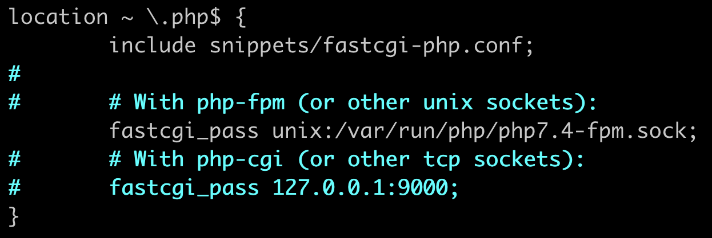

# NginX + PHP + MySQL

Aby postawić stack LEMP, postępuj według poniższej instrukcji

Na początek zaktualizuj pakiety w systemie

```bash
apt update
```

Następnie zainstaluj wymagane pakiety

```bash
apt install nginx php-fpm mariadb-server
```

Serwer już stoi. Czas aktywować PHP.

Edytuj plik **`/etc/nginx/sites-enabled/default`** i spraw, aby poniższy fragment wyglądał w nim jak na obrazku poniżej 👇 



Zrestartuj nginx

```bash
service nginx restart
```

Teraz musisz tylko [podpiąć pod to jakąś domenę przez Cloudflare](podpiecie_domeny_przez_cloudflare.md) lub [wyklikać sobie darmową w panelu](https://mikr.us/panel/?a=domain) i możesz odwiedzić swoją stronę

Aby przetestować działanie PHP, wpisz poniższe polecenie, a następnie odwołaj się do pliku test.php przez przeglądarkę.

```bash
echo "<?php phpinfo(); " >**/var/www/html/**test.php
```

Do postawienia bazy danych użyj oddzielnego poradnika:

[Instalacja i konfiguracja bazy danych](konfiguracja_mysql_mariadb.md)

[Powrót do strony głównej](/)